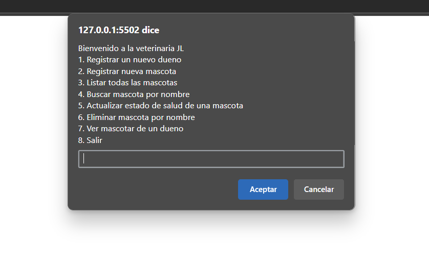
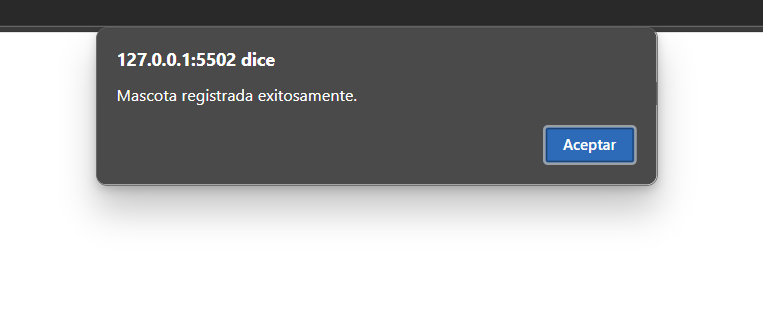
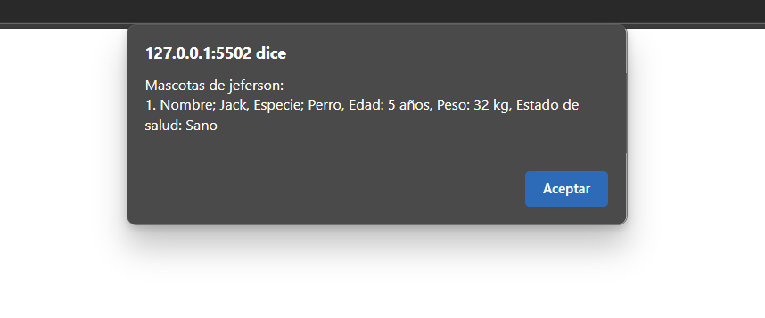

# Gestión Asíncrona de una Veterinaria JL

## Descripción del Proyecto

Este proyecto es una aplicación diseñada para gestionar de manera eficiente los procesos de una veterinaria, permitiendo el registro, consulta y actualización de información sobre dueños, mascotas y estado de salud. El enfoque principal es la gestión asíncrona de datos para mejorar la experiencia del usuario y la eficiencia del sistema.

## Tecnologías Usadas

- **JavaScript** 
- **HTML5**

## Aplicación de la Asincronía

La asincronía se implementó principalmente en la comunicación entre el frontend y el backend utilizando promesas para realizar operaciones CRUD sin recargar la página. Además, el backend utiliza funciones asíncronas (`async/await`) permitiendo respuestas rápidas y eficientes a las solicitudes de los usuarios.

## Capturas de Pantalla

### Panel Principal

### Registro de Mascotas

### Listar Mascota por Dueño

